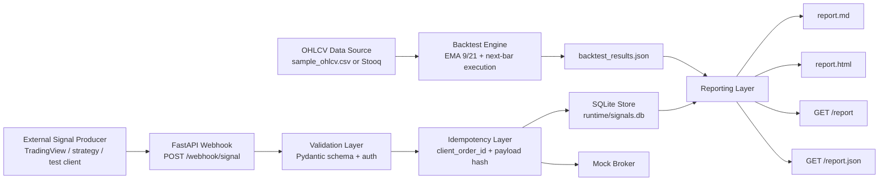
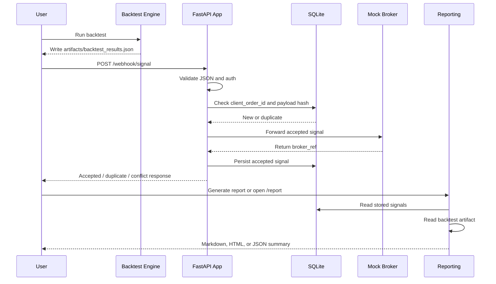

# QuantHaven

Production-style EMA crossover strategy pipeline built for the QuantHaven technical assessment.

This project covers the full lifecycle of a simple quantitative trading signal flow:

- strategy conversion from Pine Script logic to Python
- backtesting on OHLCV market data
- webhook-based signal ingestion with validation and persistence
- mock broker execution
- reporting in both Markdown and HTML

It is designed to be easy to review, easy to run locally, and structured like a small real-world service rather than a one-off script.

## Table Of Contents

- [What This Project Does](#what-this-project-does)
- [Assessment Coverage](#assessment-coverage)
- [Key Features](#key-features)
- [System Architecture](#system-architecture)
- [End-To-End Flow](#end-to-end-flow)
- [Repository Structure](#repository-structure)
- [Backtest Design](#backtest-design)
- [Webhook Service Design](#webhook-service-design)
- [Reporting Design](#reporting-design)
- [Sample Results](#sample-results)
- [Setup](#setup)
- [How To Run](#how-to-run)
- [API Reference](#api-reference)
- [Artifacts And Runtime Files](#artifacts-and-runtime-files)
- [Testing](#testing)
- [Configuration](#configuration)
- [Design Decisions And Trade-Offs](#design-decisions-and-trade-offs)
- [Future Improvements](#future-improvements)

## What This Project Does

The repository implements an end-to-end signal pipeline around a simple EMA crossover strategy:

1. Market data is loaded from a bundled OHLCV CSV fixture, or optionally from a free Stooq source.
2. The EMA(9/21) crossover strategy is executed in Python with realistic next-bar execution and trading costs.
3. Backtest results are written to a JSON artifact.
4. A FastAPI webhook receives trading signals, validates them, deduplicates them, stores them in SQLite, and forwards them to a mock broker.
5. A reporting layer combines the strategy output and persisted signals into Markdown and HTML summaries.

The project is intentionally lightweight in dependencies while still following production-oriented patterns:

- `src/` package layout
- isolated configuration layer
- SQLite persistence
- idempotent webhook behavior
- optional HMAC authentication
- automated tests
- repeatable demo flow

## Assessment Coverage

This implementation covers all three required parts of the assessment.

### 1. Pine Script To Python Conversion

The original EMA crossover trading concept is implemented in Python in [src/quanthaven/backtest.py](/Users/brat/Documents/New%20project/src/quanthaven/backtest.py).

Delivered outputs:

- total return
- win rate
- max drawdown
- number of trades
- Sharpe ratio as an additional production-style metric
- detailed trade ledger
- JSON artifact export

### 2. Webhook Receiver

The API is implemented in [src/quanthaven/api.py](/Users/brat/Documents/New%20project/src/quanthaven/api.py) and [src/quanthaven/webhook.py](/Users/brat/Documents/New%20project/src/quanthaven/webhook.py).

Delivered behavior:

- accepts JSON POST signals
- validates schema and rejects malformed payloads
- supports duplicate replay handling
- prevents conflicting reuse of the same idempotency key
- stores accepted signals in SQLite
- forwards accepted signals to a mock broker
- exposes signal listing and reporting endpoints

### 3. Reporting Output

Reporting is implemented in [src/quanthaven/reporting.py](/Users/brat/Documents/New%20project/src/quanthaven/reporting.py).

Delivered outputs:

- JSON report endpoint
- HTML report endpoint
- Markdown report artifact
- HTML report artifact

## Key Features

- EMA 9/21 crossover strategy implemented in Python
- no-lookahead backtest execution using next-bar entry/exit logic
- configurable trading costs using fee and slippage basis points
- bundled offline sample data for deterministic local runs
- optional free market data pull from Stooq
- FastAPI webhook service
- strict payload validation with Pydantic
- SQLite-backed signal persistence
- idempotent ingestion using `client_order_id`
- conflict detection when a reused idempotency key carries a different payload
- optional HMAC-SHA256 webhook signature verification
- mock broker execution with generated broker references
- Markdown and HTML report generation
- automated unit and integration-style tests
- one-command end-to-end demo script

## System Architecture



## End-To-End Flow



## Repository Structure

```text
.
├── README.md
├── LICENSE
├── pyproject.toml
├── .env.example
├── data/
│   └── sample_ohlcv.csv
├── artifacts/
│   ├── backtest_results.json
│   ├── report.md
│   └── report.html
├── runtime/
│   └── signals.db
├── scripts/
│   └── run_demo.py
├── src/
│   └── quanthaven/
│       ├── __init__.py
│       ├── api.py
│       ├── backtest.py
│       ├── broker.py
│       ├── config.py
│       ├── db.py
│       ├── models.py
│       ├── reporting.py
│       ├── security.py
│       └── webhook.py
└── tests/
    ├── test_api.py
    ├── test_backtest.py
    └── test_reporting.py
```

## Backtest Design

### Strategy Logic

The strategy is a classic long-only EMA crossover:

- buy when EMA 9 crosses above EMA 21
- sell when EMA 9 crosses below EMA 21

### Execution Semantics

To avoid lookahead bias:

- signals are detected on bar `t`
- the trade is executed on bar `t+1`
- entries use the next bar open
- exits use the next bar open

This is more realistic than trading on the same bar that generated the signal.

### Cost Model

The engine applies both:

- fee basis points per side
- slippage basis points per side

This means the backtest is not just a raw crossover calculation; it includes a basic execution friction model.

### Metrics Produced

The backtest outputs:

- `starting_capital`
- `ending_capital`
- `total_return_pct`
- `win_rate_pct`
- `max_drawdown_pct`
- `number_of_trades`
- `sharpe_ratio`
- `trades`

### Data Sources

Supported sources:

- bundled offline fixture: [data/sample_ohlcv.csv](/Users/brat/Documents/New%20project/data/sample_ohlcv.csv)
- optional live free source via Stooq

The bundled CSV makes the project deterministic and easy for reviewers to run without network access.

## Webhook Service Design

### Endpoint Purpose

The webhook simulates ingestion from an upstream signal producer such as:

- TradingView alerts
- a strategy engine
- another internal service
- a manual QA tool

### Request Validation

Incoming payloads are validated with Pydantic. Required fields:

- `symbol`
- `side`
- `qty`
- `price`

Optional fields:

- `client_order_id`
- `timestamp`

Validation rules include:

- `symbol` is normalized to uppercase
- `side` must be `buy` or `sell`
- `qty` must be greater than zero
- `price` must be greater than zero

### Idempotency

Webhook ingestion is idempotent:

- if `client_order_id` is provided, it is used as the idempotency key
- otherwise the canonical payload hash is used
- replaying the same payload returns `duplicate`
- reusing the same key with a different payload returns `409`

This mirrors real webhook safety behavior and prevents duplicate trade execution from retries.

### Authentication

Optional HMAC verification is supported through:

- header: `X-Webhook-Signature`
- algorithm: `HMAC-SHA256`

Auth is disabled by default for local review and can be enabled through environment variables.

### Persistence

Accepted signals are stored in SQLite at:

- [runtime/signals.db](/Users/brat/Documents/New%20project/runtime/signals.db)

Stored fields include:

- auto-incremented id
- symbol
- side
- qty
- price
- client_order_id
- payload hash
- broker reference
- received timestamp

### Broker Simulation

Accepted signals are forwarded to a mock broker which returns:

- broker reference
- fill status
- execution timestamp

This simulates the downstream execution handoff without requiring a live brokerage integration.

## Reporting Design

The reporting layer combines:

- strategy artifacts from the backtest
- persisted signals from SQLite

It produces:

- Markdown report file
- HTML report file
- JSON API summary
- rendered HTML response via FastAPI

### Report Contents

Current reports include:

- backtest metrics
- count of logged signals
- signal breakdown by side
- signal breakdown by symbol
- recent signal table in HTML

## Sample Results

Running the current demo produces these deterministic sample backtest values:

- total return: `19.87%`
- win rate: `100.0%`
- max drawdown: `14.25%`
- trades: `2`
- Sharpe ratio: `4.8128`

It also generates one accepted sample webhook signal:

- symbol: `AAPL`
- side: `buy`
- qty: `10`
- price: `202.5`
- client order id: `demo-1`

## Setup

### Requirements

- Python `3.11+`

### Local Installation

From the project root:

```bash
cd "/Users/brat/Documents/New project"
```

Optional virtual environment:

```bash
python3 -m venv .venv
source .venv/bin/activate
```

Install package dependencies:

```bash
pip install -e .
```

If you do not want editable install, the project also runs with `PYTHONPATH=src`.

## How To Run

### Option 1: Full Demo

This is the fastest way to verify the project:

```bash
python3 scripts/run_demo.py
```

What it does:

1. resets generated outputs
2. initializes SQLite
3. runs the backtest
4. posts a sample webhook signal
5. generates reports
6. prints all outputs to the terminal

### Option 2: Run Each Part Separately

#### Backtest

```bash
PYTHONPATH=src python3 -m quanthaven.backtest --data-file data/sample_ohlcv.csv
```

Optional Stooq symbol:

```bash
PYTHONPATH=src python3 -m quanthaven.backtest --symbol aapl.us
```

Generated file:

- [artifacts/backtest_results.json](/Users/brat/Documents/New%20project/artifacts/backtest_results.json)

#### API Server

```bash
PYTHONPATH=src uvicorn quanthaven.api:app --reload
```

Open in browser:

- [http://127.0.0.1:8000/report](http://127.0.0.1:8000/report)
- [http://127.0.0.1:8000/report.json](http://127.0.0.1:8000/report.json)

#### Send A Valid Signal

```bash
curl -X POST http://127.0.0.1:8000/webhook/signal \
  -H "Content-Type: application/json" \
  -d '{"symbol":"AAPL","side":"buy","qty":"10","price":"202.5","client_order_id":"demo-1"}'
```

#### Send An Invalid Signal

```bash
curl -X POST http://127.0.0.1:8000/webhook/signal \
  -H "Content-Type: application/json" \
  -d '{"symbol":"AAPL","side":"buy"}'
```

#### Generate Reports Manually

```bash
PYTHONPATH=src python3 -m quanthaven.reporting
```

Generated files:

- [artifacts/report.md](/Users/brat/Documents/New%20project/artifacts/report.md)
- [artifacts/report.html](/Users/brat/Documents/New%20project/artifacts/report.html)

## API Reference

### `POST /webhook/signal`

Ingest a trading signal.

Example payload:

```json
{
  "symbol": "AAPL",
  "side": "buy",
  "qty": "10",
  "price": "202.5",
  "client_order_id": "demo-1"
}
```

Success response:

```json
{
  "status": "accepted",
  "signal": {
    "id": 1,
    "symbol": "AAPL",
    "side": "buy",
    "qty": "10",
    "price": "202.5",
    "client_order_id": "demo-1",
    "broker_ref": "MOCK-...",
    "received_at": "2026-04-27T02:13:02.818465+00:00"
  }
}
```

Duplicate replay response:

```json
{
  "status": "duplicate",
  "signal": {
    "id": 1,
    "symbol": "AAPL",
    "side": "buy",
    "qty": "10",
    "price": "202.5",
    "client_order_id": "demo-1",
    "broker_ref": "MOCK-...",
    "received_at": "..."
  }
}
```

Common status codes:

- `200` accepted
- `200` duplicate replay with same payload
- `401` invalid HMAC signature when auth is enabled
- `409` idempotency key reused with a different payload
- `422` schema validation failure

### `GET /signals`

Returns persisted signals.

### `GET /report`

Returns rendered HTML report.

### `GET /report.json`

Returns combined JSON summary.

## Artifacts And Runtime Files

### Committed Or Generated Artifacts

- [artifacts/backtest_results.json](/Users/brat/Documents/New%20project/artifacts/backtest_results.json)
- [artifacts/report.md](/Users/brat/Documents/New%20project/artifacts/report.md)
- [artifacts/report.html](/Users/brat/Documents/New%20project/artifacts/report.html)

### Runtime Data

- [runtime/signals.db](/Users/brat/Documents/New%20project/runtime/signals.db)

## Testing

Run the full test suite:

```bash
python3 -m unittest discover -s tests -v
```

The current suite covers:

- EMA calculation behavior
- backtest metrics generation
- next-bar backtest execution semantics
- valid webhook ingestion
- duplicate replay behavior
- idempotency conflict behavior
- invalid payload handling
- HMAC auth rejection
- Markdown and HTML report rendering

## Configuration

Environment variables are loaded through [src/quanthaven/config.py](/Users/brat/Documents/New%20project/src/quanthaven/config.py).

Example configuration file:

- [.env.example](/Users/brat/Documents/New%20project/.env.example)

Supported settings:

- `QUANTHAVEN_DISABLE_AUTH`
- `QUANTHAVEN_WEBHOOK_SECRET`

Default local behavior:

- auth disabled
- local artifacts directory enabled
- local SQLite runtime directory enabled

To enable HMAC verification:

```bash
export QUANTHAVEN_DISABLE_AUTH=false
export QUANTHAVEN_WEBHOOK_SECRET="your-secret"
```

## Design Decisions And Trade-Offs

### Why SQLite

SQLite is a strong fit for this assessment because it provides:

- real persistence
- transactional writes
- simple local setup
- enough structure to demonstrate production-style storage behavior

If this system scaled further, PostgreSQL plus migrations would be the natural next step.

### Why No-Lookahead Execution

Many simple take-home backtests accidentally overstate performance by entering on the same bar that triggered the signal. This implementation avoids that by trading on the next bar open.

### Why Bundled Sample Data

Reviewers should be able to run the project immediately without:

- internet access
- API keys
- flaky data vendor dependencies

### Why Optional Auth

HMAC auth is important for real webhook integrity, but it is disabled by default so the reviewer can test quickly with plain `curl`.

## Future Improvements

If this project were extended beyond the assessment, the next most valuable upgrades would be:

- Dockerfile and container-based local startup
- CI pipeline for tests and linting
- Alembic-style database migrations
- structured JSON logging
- richer HTML reporting with charts
- live broker adapter behind an interface
- Postgres instead of SQLite
- retry and dead-letter behavior for failed broker handoffs
- more extensive property and load testing

## Final Notes

This repository is intended to demonstrate not just that the three assessment tasks were completed, but that they were integrated into a coherent, reviewable system with realistic engineering decisions:

- deterministic local demo path
- real persistence
- safe webhook semantics
- clearer architecture
- test coverage over core flows

For the fastest evaluation path, run:

```bash
python3 scripts/run_demo.py
```
